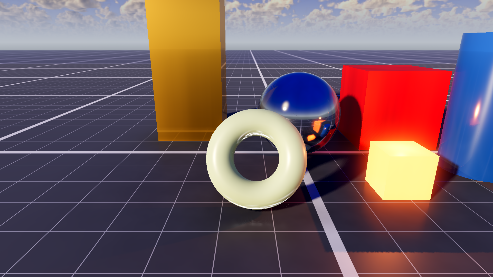

# VibeScape — AAA Environment Starter Kit

A drop-in **AAA-looking world** for Godot 4. It wires the **VibeScape World**
(lighting + sky) and **VibeScape Clouds** (volumetric clouds) addons together in
one scene over a greybox stage with a material showcase. Open it, press Play, and
you already have a lit world with sky, GI, shadows, reflections and drifting
volumetric clouds — a real starting point to build your game on, not yet another
asset you'll never use.

## Requirements

- Godot **4.3+** (built/tested on 4.6, Forward+).

## Running it

1. Open this folder as a project in Godot (it's the `project.godot` root).
2. Both plugins are already enabled (Project Settings → Plugins).
3. Press **Play** (F5) — `main.tscn` is the main scene.

## What's in the scene

Everything lives **directly in `main.tscn`** — the environment is not hidden
behind an instanced sub-scene, so it's an honest, editable clean start:

- **GameWorld** — the whole lighting environment (WorldEnvironment + key
  DirectionalLight3D) on the *Sunny* preset. Tweak the preset/knobs in the
  inspector. From the **VibeScape World** addon.
- **VolumetricClouds** — a raymarched cloud deck rendered over the sky and
  occluded by geometry. From the **VibeScape Clouds** addon.
- **Ground** — a world-space blueprint grid (greybox), so light, shadows and GI
  have something to read against.
- **Material showcase** — a set of primitives stress-testing the look:
  chrome mirror sphere, polished gold + glossy blue metals, a clearcoat red box,
  an **emissive** ember cube (with a warm OmniLight), and a **subsurface-scatter**
  wax torus — so reflections (SSR), GI, glow and AO all show.
- **ReflectionProbe** + a **Decal** floor stain for grounding.
- **Camera3D** — a free-fly camera (hold RMB to look, WASD to move).

## Bundled addons

This project vendors both addons under `addons/` so it runs out of the box. They
are also published as standalone repos:

- VibeScape World — `addons/game_environment/`
- VibeScape Clouds — `addons/volumetric_clouds/`

See each addon's own `README.md` for its full property reference.

## License

MIT — see `LICENSE`. Bundled addons keep their own licenses; the grid floor
shader uses Ben Golus's "Pristine Grid" technique (see `LICENSE` for the link).
