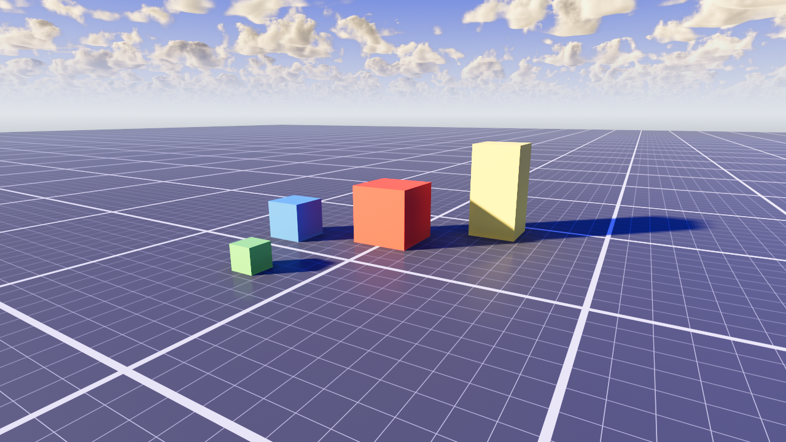

# VibeScape World

> ⚠️ **Alpha (0.0.1).** API and presets may still change.

A complete lighting environment as a **single drop-in node**. Add one
**GameWorld** node and you get a configured `WorldEnvironment` (Environment +
auto-exposure camera attributes) and a key `DirectionalLight3D` as internal
children, with **lighting presets** and only the look knobs you actually tune
exposed on the node. The heavy, rarely-touched render settings (GI, reflections,
tonemap) are baked in code so the inspector stays focused.

## What it sets up for you

Baked into `GameWorld` so you don't wire it by hand:

- **Sky** — a tuned procedural gradient sky (deep-blue zenith → pale Mie horizon).
- **Global illumination & reflections** — SDFGI, SSIL, SSAO, SSR.
- **Atmosphere** — horizon fog + volumetric fog.
- **Post** — ACES tonemap, glow, saturation/contrast colour grade.
- **Sun** — shadow bias / normal-bias and CSM split tuning that holds up on big scenes.
- **Camera** — practical auto-exposure attributes.

## Requirements

- Godot **4.3+**.

## Installation

**From the Godot Asset Library (in-editor):**
1. Open the **AssetLib** tab at the top of the editor.
2. Search for **VibeScape World**, click **Download**, then **Install**.
3. **Project → Project Settings → Plugins** → enable **VibeScape World**.

**Manual:**
1. Copy the `game_environment` folder into your project's `addons/` folder
   (final path: `res://addons/game_environment/`).
2. **Project → Project Settings → Plugins** → enable **VibeScape World**.

## Adding it to a scene

In your 3D scene: **Add Child Node** → search **GameWorld** → Create. Done — you
have lighting, sky, GI and a sun. There is nothing else to wire; the
`WorldEnvironment` and `DirectionalLight3D` live *inside* the node as internal
children.

> One `GameWorld` per scene (it owns the scene's WorldEnvironment).

## Presets

The inspector opens with a **Lighting preset** row:

| Preset       | Look |
|--------------|------|
| **Sunny**    | Low warm sun, crisp shadows, light haze |
| **Overcast** | High soft sun, flat bright ambient, dense fog |
| **Evening**  | Near-horizon sun, long warm shadows, glow |

Picking a preset fills all the knobs below. Editing any knob afterwards freely
overrides it — the node keeps the preset label, but your value wins (the preset
acts as a starting point, not a lock). Set `preset` to **Custom** to manage every
value yourself.

## Properties

### Sun

| Property         | Range          | Default            | Meaning |
|------------------|----------------|--------------------|---------|
| `sun_altitude`   | -10 – 90°      | 22                 | Sun height above the horizon, in degrees. Low = long shadows / golden hour. |
| `sun_azimuth`    | -180 – 180°    | -48                | Sun compass heading, in degrees (rotates the light around). |
| `sun_color`      | Color          | warm white         | Colour of the key light. |
| `sun_energy`     | 0 – 16         | 3.1                | Brightness of the key light. |
| `sun_angular`    | 0 – 10         | 1.3                | Apparent angular size of the sun disc. Larger = softer shadow edges. |
| `shadow_opacity` | 0 – 1          | 1.0                | How dark the sun's shadows are (1 = full, lower = lifted/soft). |
| `shadow_distance`| 20 – 400 m     | 60                 | How far directional shadows reach. **Match it to your scene scale:** short = crisp, denser shadow texels; long spreads texels thin and small geometry (stairs/ramps) self-shadows into stripes. Small interior ~40, open world ~120. |

### Exposure & Ambient

| Property         | Range   | Default | Meaning |
|------------------|---------|---------|---------|
| `exposure`       | 0 – 4   | 0.85    | Tonemap exposure (overall brightness before auto-exposure). |
| `ambient_energy` | 0 – 4   | 1.0     | Strength of the sky-based ambient light filling shadows. |

### Horizon Fog

The distance/height haze that forms along the horizon (standard Godot fog).

| Property             | Range        | Default        | Meaning |
|----------------------|--------------|----------------|---------|
| `fog_density`        | 0 – 0.02     | 0.0004         | Thickness of the horizon haze. |
| `fog_height`         | -50 – 50 m   | -4             | World-space Y the fog bank sits at. Raise for a higher horizon haze. |
| `fog_height_density` | 0 – 0.5      | 0.03           | How quickly the fog thins above `fog_height`. 0 = uniform; higher = a thin low band. |
| `fog_light_color`    | Color        | cool blue      | Tint of the horizon fog. |
| `fog_type`           | Exp / Depth  | Exponential    | Falloff model: Exponential (height-based haze) or Depth (distance-based). |

### Volumetric Fog

In-air light scattering (separate from the horizon haze) — catches god-rays and gives depth.

| Property                 | Range     | Default      | Meaning |
|--------------------------|-----------|--------------|---------|
| `volumetric_fog_density` | 0 – 0.05  | 0.0012       | Density of the volumetric scattering medium. |
| `volumetric_fog_albedo`  | Color     | pale blue    | Colour of the scattered light. |

### Effects

| Property         | Range   | Default | Meaning |
|------------------|---------|---------|---------|
| `glow_intensity` | 0 – 8   | 0.15    | Strength of the bloom/glow on bright pixels. |
| `ssao_intensity` | 0 – 8   | 2.2     | Strength of screen-space ambient occlusion (contact darkening in crevices). |

### Colour Grade

| Property     | Range   | Default | Meaning |
|--------------|---------|---------|---------|
| `saturation` | 0 – 2   | 1.25    | Colour saturation of the final image (1 = neutral). |
| `contrast`   | 0 – 2   | 1.08    | Contrast of the final image (1 = neutral). |

## Clouds

`GameWorld` ships a plain procedural sky on purpose. For volumetric clouds, add
the separate **VibeScape Clouds** addon and drop a `VolumetricClouds` node in
the same scene — it renders on top of this sky and finds the GameWorld sun on
its own. Neither node references the other, so each is optional.

## License

MIT — see `LICENSE.txt`.
