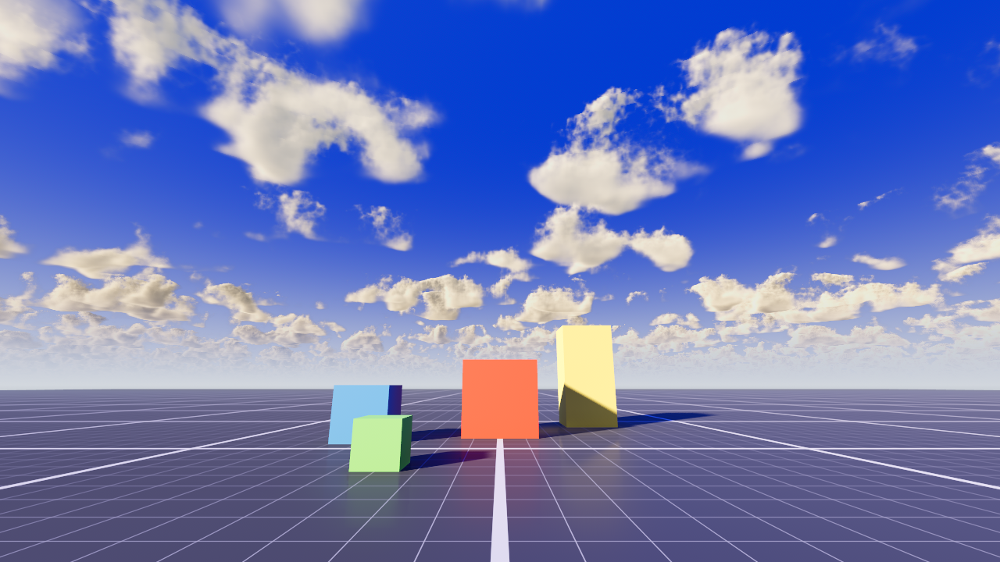

# VibeScape Clouds

AAA raymarched volumetric clouds for Godot 4, rendered as a **separate overlay layer**
— not a Sky material. The cloud deck is drawn on a camera-locked, inverted
sky-dome and composited (premultiplied alpha) *over* whatever atmosphere you
already have, and it is correctly occluded by scene geometry.

Cloud model: "The Real-time Volumetric Cloudscapes of Horizon: Zero Dawn"
(Schneider / Guerrilla, SIGGRAPH 2015). See `THIRDPARTY.md` for full credits.

## Why an overlay (and not a Sky)

Because the clouds are just transparent geometry composited over the sky:

- **Hide the node → clouds vanish, sky stays.** No need to swap Sky resources.
- **Stack layers.** Drop several `VolumetricClouds` nodes at different `height`
  / `cloudiness` / `density` and they blend over each other as distinct decks.
- **Geometry occludes them.** Buildings and terrain cut into the cloud deck the
  way they should, which a Sky material can't do.

## Requirements

- Godot **4.3+** (uses `NoiseTexture3D` and premultiplied-alpha spatial shaders).
- A **`DirectionalLight3D`** somewhere in the scene — the clouds use it as the sun.

## Installation

**From the Godot Asset Library (in-editor):**
1. Open the **AssetLib** tab at the top of the editor.
2. Search for **VibeScape Clouds**, click it, press **Download**, then **Install**.
3. **Project → Project Settings → Plugins** and toggle **VibeScape Clouds** to *Enabled*.

**Manual:**
1. Copy the `volumetric_clouds` folder into your project's `addons/` folder
   (final path: `res://addons/volumetric_clouds/`).
2. **Project → Project Settings → Plugins** → enable **VibeScape Clouds**.

## Adding clouds to a scene

1. In the scene tree, **Add Child Node** → search **VolumetricClouds** → Create.
   (The node appears in the Create dialog once the plugin is enabled.)
2. Make sure the scene also has a **DirectionalLight3D**. That's it — the clouds
   find the light at runtime and read its direction, colour and energy as the
   sun. No signals or wiring to set up.

The dome auto-follows the active camera in the editor *and* at runtime, so the
clouds always surround the viewer. To add a second cloud deck, just add another
`VolumetricClouds` node with a different `height`.

## Properties

The inspector opens with a **Cloud form** row of one-click presets —
**Stratus**, **Stratocumulus**, **Cumulus** — that set `cloudiness` + `density`
to a typical look you can then fine-tune.

### Shape

| Property     | Range        | Default | Meaning |
|--------------|--------------|---------|---------|
| `height`     | 500 – 4000 m | 1500    | Altitude of this cloud deck above the horizon. Stack decks at different heights for layered skies. |
| `cloudiness` | 0.1 – 1.0    | 0.4     | How much of the sky the layer fills (coverage). Low = scattered clouds, high = overcast. |
| `density`    | 0.01 – 0.2   | 0.055   | Optical thickness of the cloud medium — how dark/solid the clouds get. |

### Light

| Property     | Range      | Default | Meaning |
|--------------|------------|---------|---------|
| `brightness` | 0.0 – 1.0  | 0.21    | Overall brightness of the in-cloud lighting (exposure of the cloud layer). |
| `sun_spread` | 0.1 – 0.9  | 0.5     | How far the sun's brightening spreads across the clouds. Higher = wider, softer, more even glow; lower = a tight hotspot around the sun. |

### Wind

| Property           | Range      | Default     | Meaning |
|--------------------|------------|-------------|---------|
| `wind_direction`   | Vector2    | (1.0, 0.3)  | Direction the cloud field drifts (XZ). |
| `wind_speed`       | 0.0 – 20.0 | 1.0         | How fast the whole field drifts along `wind_direction`. |
| `turbulence_speed` | 0.0 – 4.0  | 1.0         | Speed of the edge churn / internal turbulence, **independent** of the drift. 1.0 = reference; 0 = frozen shapes that only slide. |

### Quality

| Property              | Range    | Default | Meaning |
|-----------------------|----------|---------|---------|
| `march_steps_horizon` | 16 – 256 | 160     | Raymarch steps toward the horizon, where the cloud path is longest. Higher = less shimmer on far clouds, but more GPU. The main quality/perf dial. |
| `march_steps_zenith`  | 16 – 256 | 64      | Raymarch steps straight overhead, where the path is short — needs far fewer steps, so keep this low. |

### Performance notes

This is a real raymarch: cost scales with the step counts **and** screen
resolution. If far clouds shimmer, raise `march_steps_horizon`; if you need
frames back, lower it first (the zenith path is cheap and can stay low). Each
extra `VolumetricClouds` layer is another full raymarch — stack them sparingly.

## License

MIT — see `LICENSE.txt`. Contains third-party MIT code; see `THIRDPARTY.md`.
